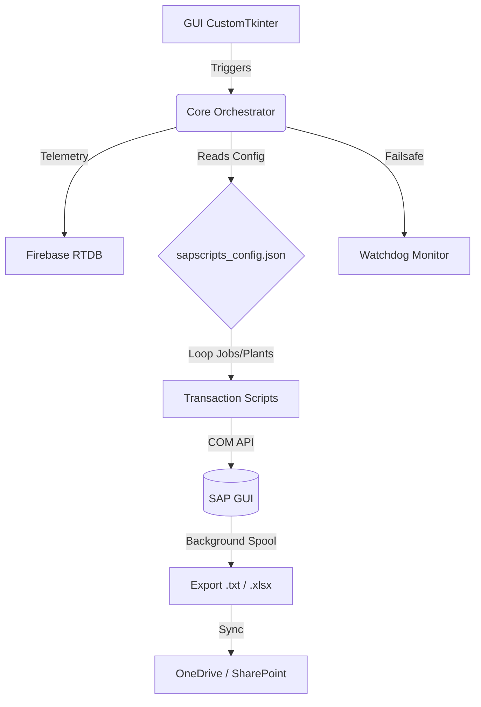

# SAP Logistics RPA Hub

A robust, data-driven Robotic Process Automation (RPA) orchestrator built in Python to automate complex SAP GUI tasks across multiple manufacturing plants. Designed for large-scale logistics operations, it extracts, validates, and pushes data to a cloud ETL pipeline entirely in the background.

## Key Features

- **Data-Driven Architecture**: Fully configured via JSON (`sapscripts_config.json`). Adding a new plant, changing a transaction variant, or setting up a new report requires zero code changes.
- **Intelligent Watchdog**: Built-in failsafe monitor runs on a separate thread to detect SAP GUI hangs, network timeouts, or script crashes. It automatically kills unresponsive processes and gracefully restarts the execution loop.
- **Asynchronous UI**: A modern, non-blocking graphical interface built with `customtkinter`. It provides real-time progress tracking, live logging, and thread-safe execution to ensure the UI remains responsive during heavy SAP COM interactions.
- **Over-The-Air (OTA) Updates**: Includes a custom deployment script (`tools/deploy.py`) that compiles the project into a standalone executable via PyInstaller and pushes it to a shared cloud drive, allowing seamless distribution to machines without Python installed.
- **Windows Insomnia Mode**: Direct integration with the Windows API (`SetThreadExecutionState`) prevents the host machine from sleeping or locking during long-running background extractions.

## Architecture

### Module Structure

- `core/`: Contains the `orchestrator` (manages the event loop and state) and the `watchdog` (resilience monitor).
- `transactions/`: Modular scripts handling specific SAP screens and workflows. Abstracts boilerplate through utility functions to adhere to DRY principles.
- `config/`: JSON configurations mapping SAP variants (`/VARIANT`), printers, and paths per manufacturing plant.
- `gui/`: Application frontend built with CustomTkinter, divided into setup, login, and progress pages.
- `tools/`: CI/CD scripts for local PyInstaller compilation and OTA deployment.

## Portfolio Showcase & Architectural Highlights

This repository serves as a technical portfolio piece demonstrating advanced Python architecture applied to RPA. Because the SAP landscape, custom transactions, and logistics variants are highly specific to this environment, this project is not intended to be a plug-and-play library for other companies. 

If you are reviewing this code, I highly recommend checking out:
- **`core/orchestrator.py`**: Notice the dynamic handler discovery (`_get_job_handler`) and the event loop.
- **`core/watchdog.py`**: A parallel daemon thread handling disaster recovery and failsafes.
- **`transactions/request.py`**: Shows how repetitive SAP COM interactions are abstracted to keep the code DRY.
- **`config/sapscripts_config.example.json`**: Demonstrates the Data-Driven approach that allows scaling to new plants without writing new code.

*Disclaimer: This repository has been sanitized for public release. Internal corporate IPs, credentials, and proprietary layout variants have been removed or replaced with generic placeholders.*

## Vinicius L.